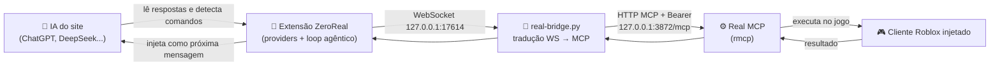

# ⚡ ZeroReal

### Use ChatGPT, DeepSeek, Gemini e outras IAs da web como agentes do executor Real

[](./LICENSE)
[](./bridge/)
[](./extension/)


O **ZeroReal** transforma um chat normal de IA (ChatGPT, DeepSeek, Google Gemini, Kimi, GLM, Qwen, Arena, Meta AI ou Ox Alpha) num **agente que pilota o seu jogo através do executor Real**: é só descrever o que você quer — ele executa Luau, inspeciona instâncias, lê scripts, espiona remotes, tira screenshots e dirige o jogo com input real.

> Sem API key. Sem terminal. Sem pagar nada. A IA dos sites + o seu Real.

---

## ✨ Como funciona



Você escreve *"verifica meu HP e me cura se tiver baixo"* — a IA escreve um comando na resposta, a extensão executa no seu jogo via Real e devolve o resultado no chat. Tudo sozinho, turno após turno.

## 🧰 O que a IA consegue fazer

| Categoria | Ferramentas |
|---|---|
| 📜 Luau | `get-data-by-code` (print + return), `eval`, `execute`, `live-reload` (loops/ESP sem duplicar) |
| 🔍 Inspeção | `search-instances`, `get-descendants-tree`, `get-instance-properties`, `get-tagged`, `list-players` |
| 📜 Scripts | `get-script-content` (decompile), `script-grep`, `get-script-strings`, `build-script-index`, `find-remote-callers` |
| 📡 Remotes | `remote-spy`, `inbound-spy`, `fire-remote`, `spy-closure`, `gc-scan` |
| 🖱️ Input real | `send-input` (teclado + mouse), `type-text-box` |
| 📸 Visão | `screenshot-window`, `dump-visible-ui` |
| 🧠 Memória | `remember-game`, `recall-game-memory`, `game-feedback` (persiste por jogo) |
| 📚 Ajuda | `search-api` (toda a API do Real antes de chutar global) |

## 🤖 IAs suportadas

| IA | Endereço | Obs |
|---|---|---|
| **DeepSeek** (recomendada) | `chat.deepseek.com` | Pensamento Profundo + Pesquisa, tudo ligado |
| ChatGPT | `chatgpt.com` | sem visão (cota free separa imagens) |
| Gemini | `gemini.google.com` | pode parar de usar as tools em sessões longas |
| Kimi | `kimi.com` | às vezes tenta as tools nativas dela |
| GLM | `chat.z.ai` | ✅ |
| Qwen | `chat.qwen.ai` | ✅ |
| Arena | `arena.ai` | usar modo **Direct** |
| Meta AI | `meta.ai` | ✅ |
| Ox Alpha | `oxalpha.com` | ✅ |

---

## 🚀 Instalação (5 minutos)

### 1️⃣ Pré-requisitos

- Windows + Python 3.10+ ([baixar](https://www.python.org/downloads/)) — marque **Add to PATH**
- App **Real** aberto (servidor MCP ativo)
- Roblox aberto, **Real injetado**, dentro de um jogo
- Chrome ou Edge

### 2️⃣ Baixe o projeto

```bash
git clone https://github.com/Ryanabcraft/zeroreal.git
cd zeroreal
```

### 3️⃣ Suba o bridge

Duplo-clique em **`bridge/start-real.bat`** e deixe a janela aberta. Na primeira vez ele instala sozinho o que falta (`websockets` + `requests`).

> 🔑 **Token:** o bridge lê sozinho a porta e o token atuais do Real em
> `%LOCALAPPDATA%\Real\data\sessions\mcp\endpoint.json` — se o Real girar o
> token ou trocar de porta, ele se ressincroniza sem você fazer nada.
> Só edite `bridge/config.json` (copie de `config.example.json`) se quiser
> fixar valores manualmente.

### 4️⃣ Instale a extensão

1. Abra `edge://extensions` (Edge) ou `chrome://extensions` (Chrome)
2. Ative o **Modo do desenvolvedor** (canto superior direito)
3. Clique em **Carregar sem compactação** e selecione a pasta **`extension/`**
4. Pronto — o ícone ⚡ aparece na barra

### 5️⃣ Use

1. Abra um **chat novo** na IA (ex. `https://chat.deepseek.com`)
2. Clique em **▶︎ Start Real agent** na barrinha que aparece sobre o composer
3. Digite o que você quer. Exemplos:
   - *"lista os players do servidor com HP e posição"*
   - *"acha todos os remotes com 'Damage' no nome e mostra quem chama cada um"*
   - *"tira um screenshot do jogo e descreve o que você vê"*

---

## 📁 Estrutura

```
zeroreal/
├── extension/            # extensão Chrome/Edge (Manifest V3)
│   ├── core/
│   │   ├── config.js     # prompt do sistema, categorias e notas das tools
│   │   ├── parser.js     # parsing de comandos (###LUA### e {"command":...})
│   │   └── main.js       # loop agêntico, UI, camouflagem, sessão
│   ├── providers/        # um arquivo por site de IA (mesma interface)
│   ├── background.js     # WebSocket com o bridge (porta 17614)
│   ├── manifest.json
│   └── popup.html / popup.js
├── bridge/
│   ├── real-bridge.py    # WS 17614 → Real MCP (handshake initialize + Bearer)
│   ├── config.example.json
│   └── start-real.bat
├── LICENSE               # GPL-3.0-or-later
└── README.md
```

### Adicionar outro site de IA

Escreva `extension/providers/<site>.js` exportando a mesma interface `ZSProvider`, registre a URL em `manifest.json` (`content_scripts` + `host_permissions`) e em `PROVIDER_URLS` no `background.js`. O núcleo não muda.

### Testes (sem dependências)

```bash
cd extension
node test-parser.js    # parser de comandos
node test-chatgpt.js   # leitura de respostas do ChatGPT
```

---

## 🩺 Problemas comuns

| Sintoma | Causa provável | O que fazer |
|---|---|---|
| Bolinha cinza / "Bridge offline" | `start-real.bat` fechado | Rode o `.bat` e deixe aberto |
| "Real not connected · inject Real in a game" | Nada injetado / fora do jogo | Injete o Real e entre num jogo; clique ↻ Reconnect |
| "Message could not be sent" | Site recusou a injeção | Mande um "continue" manualmente no chat |
| Tools girando pra sempre | Cliente travou / FPS no chão | Reinjete; confira `get-console-output` |
| `401` no log do bridge | Token dessincronizado | Ele se corrige sozinho (lê `endpoint.json`); se persistir, reinicie o Real |
| Página pede reload após update | Chrome atualizou a extensão | Aperte F5 na aba do chat |

## ⚠️ Notas

- `Execute` e `Input` deixam a IA rodar código e mexer no mouse/teclado — revise os toggles de permissão no Real.
- Loops/ESP/hooks: a IA usa `live-reload` com label estável (nunca empilha cópias).
- Antes de usar global novo no Luau, a IA consulta `search-api` — chutar função que não existe é o erro mais comum.
- Para buscas repetidas em scripts, ela roda `build-script-index` primeiro.

## 📄 Licença

[GPL-3.0-or-later](./LICENSE) — livre para usar, estudar, modificar e distribuir.
Seções da extensão original © sebattfg (ZeroScript-Free); adaptação Real © Ryanabcraft.
